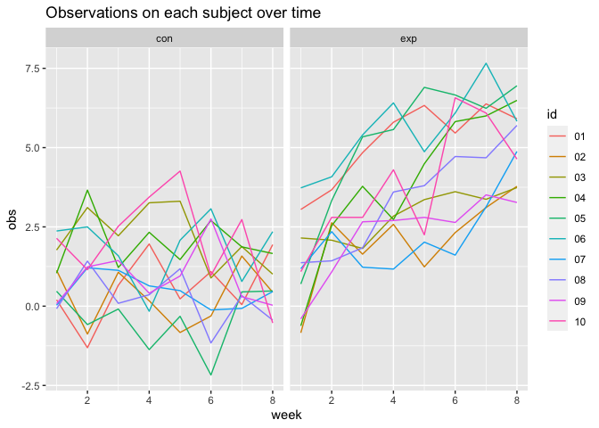
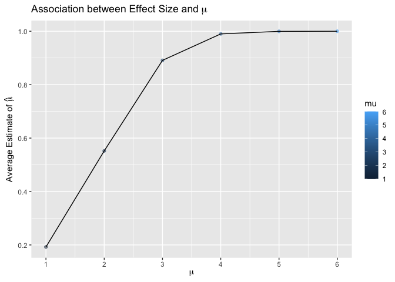
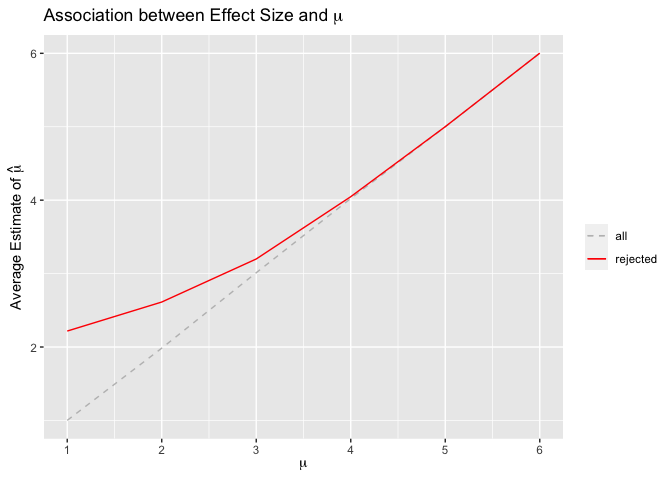

p8105_hw5_yc4384
================
Yangyang Chen
2023-11-15

## *Problem 1*

- Create a city_state variable.

- Summarize within cities to obtain the total number of homicides and
  the number of unsolved homicides.

``` r
homicide_df = 
  read_csv("data/homicide-data.csv") |> 
  janitor::clean_names() |> 
  mutate(
    city_state = str_c(city, state, sep = ", "),
         case_type = case_match(
           disposition,
           "Open/No arrest" ~ "unsolved",
           "Closed without arrest" ~ "unsolved",
           "Closed by arrest" ~ "solved",)) |> 
  select(city_state, case_type) |> 
  filter(city_state != "Tulsa, AL") 
```

Hence, the total number of homicides was 52178 and the number of
unsolved homicides 26505.

- Each city’s total number of homicides and the number of unsolved
  homicides are summarized as follows:

| city_state      | total_num | unsolved_num |
|:----------------|----------:|-------------:|
| Albuquerque, NM |       378 |          146 |
| Atlanta, GA     |       973 |          373 |
| Baltimore, MD   |      2827 |         1825 |
| Baton Rouge, LA |       424 |          196 |
| Birmingham, AL  |       800 |          347 |
| Boston, MA      |       614 |          310 |

- The proportion of homicides that are unsolved was 0.646; confidence
  interval was \[0.628, 0.663\]:

``` r
# Function to perform prop.test and extract information
prop.test(summarized_df |> filter(city_state %in% "Baltimore, MD") |> pull(unsolved_num), summarized_df |> filter(city_state %in% "Baltimore, MD") |> pull(total_num)) |> 
  broom::tidy() |> 
  select(estimate, conf.low, conf.high) |> 
  head() |> 
  knitr::kable(digits = 3)
```

| estimate | conf.low | conf.high |
|---------:|---------:|----------:|
|    0.646 |    0.628 |     0.663 |

- Run `prop.test` for each of the cities in your dataset;

- Extract both the proportion of unsolved homicides and the confidence
  interval for each.

``` r
# Apply prop.test for each city and extract information
tidy_df = 
  summarized_df |> 
  mutate(
    prop_test = map2(unsolved_num, total_num, \(x, y) prop.test(x = x, n = y, conf.level=0.95)),
    tidy_test = map(prop_test, broom::tidy)
  ) |> 
  select(-prop_test) |> 
  unnest(tidy_test) |> 
  select(city_state, estimate, conf.low, conf.high) |> 
  mutate(city_state = fct_reorder(city_state, estimate))

tidy_df |> 
  head() |> 
  knitr::kable(digits = 3)
```

| city_state      | estimate | conf.low | conf.high |
|:----------------|---------:|---------:|----------:|
| Albuquerque, NM |    0.386 |    0.337 |     0.438 |
| Atlanta, GA     |    0.383 |    0.353 |     0.415 |
| Baltimore, MD   |    0.646 |    0.628 |     0.663 |
| Baton Rouge, LA |    0.462 |    0.414 |     0.511 |
| Birmingham, AL  |    0.434 |    0.399 |     0.469 |
| Boston, MA      |    0.505 |    0.465 |     0.545 |

- Create a plot that shows the estimates and CIs for each city.

- Organize cities according to the proportion of unsolved homicides.

``` r
tidy_df |> 
  mutate(city_state = fct_reorder(city_state, estimate)) |> 
  ggplot(aes(y = city_state, x = estimate)) +
  geom_point() + 
  geom_errorbar(aes(xmin = conf.low, xmax = conf.high)) + 
  theme(text = element_text(size = 10))
```

<!-- -->

This figure suggests a very wide range in the rate at which homicides
are solved – Chicago is noticeably high and, given the narrowness of the
CI, likely is the location of many homicides.

## *Problem 2*

Create a tidy dataframe containing data from all participants, including
the subject ID, arm, and observations over time:

\*Start with a dataframe containing all file names; the list.files
function will help.

\*Iterate over file names and read in data for each subject using
purrr::map and saving the result as a new variable in the dataframe.

\*Tidy the result; manipulate file names to include control arm and
subject ID, make sure weekly observations are “tidy”, and do any other
tidying that’s necessary.

``` r
import_file = function(path = "data/prob2/", name){
  read_csv(str_c(path, name), show_col_types = F)
}

pt_df = 
  tibble(file_name = list.files("data/prob2/")) |> 
  mutate(data = map(file_name, import_file, path = "data/prob2/")) |> 
  unnest(data) |> 
  mutate(file_name = str_remove(file_name, ".csv")) |> 
  separate(file_name, into = c("arm", "id"), sep = "_") |> 
  pivot_longer(
    week_1: week_8,
    names_to = "week",
    values_to = "obs",
    names_prefix = "week_",
    names_transform = list(week = as.numeric)
  )

pt_df |> 
  ggplot(aes(x = week, y = obs, group = id, color = id)) +
  geom_line() +
  facet_grid(.~ arm) +
  labs(title = "Observations on each subject over time")
```

<!-- -->

The plot shows that the observations from the experimental group
increased over time; while observations in control group fluctuated
within a range of -2.5 to 3.5.

## Problem 3

- Set $\mu = 0$:

``` r
sim_mean_sd = 
  function(mu, n = 30, sigma = 5){
    rnorm(n, mean = mu, sd = sigma) |> 
      t.test() |> broom::tidy() |> 
      select(estimate, p.value)
}
```

``` r
sim_results_df = 
  expand_grid(
    mu = 0,
    iter = 1:5000
  ) |> 
  mutate(
    estimate_df = map(mu, sim_mean_sd)) |> 
  unnest(estimate_df)
```

- Set $\mu = {1,2,3,4,5,6}$:

``` r
sim_results_df_2 = 
  expand_grid(
    mu = c(1:6),
    iter = 1:5000
  ) |> 
  mutate(
    estimate_df = map(mu, sim_mean_sd)) |> 
  unnest(estimate_df)
```

- First plot:

``` r
  sim_results_df_2 |> 
  group_by(mu) |> 
  summarise(
    power = sum(p.value < 0.05) / n()
  ) |> 
  ggplot(aes(x = mu, y = power)) +
  geom_point(aes(color = mu), alpha = .5) +
  geom_line() +
  labs(title = TeX("Association between Effect Size and $\\mu$"), x = TeX("$\\mu$"),  y = TeX("Average Estimate of $\\hat{\\mu}$")) +
  theme(axis.ticks.length.x = unit(1, "mm")) +
  scale_x_continuous(breaks = seq(1, 7, by = 1))
```

<!-- -->

Therefore, the association between effect size and power is the higher
effect size, the higher the power is.

- Second plot:

``` r
  sim_results_df_2 |> 
  group_by(mu) |> 
  summarise(mu_hat = mean(estimate)) |> 
  ggplot(aes(x = mu, y = mu_hat)) +
  geom_line(aes(color = "all", lty = "all")) +
  geom_line(data = 
              sim_results_df_2 |>
              filter(p.value < 0.05) |> 
              group_by(mu) |> 
              summarise(mu_hat = mean(estimate)),
            aes(color = "rejected", lty = "rejected")) +
  scale_color_manual(name = "", values = c("all" = "grey", "rejected" = "red")) +
  scale_linetype_manual(name = "", values = c("all" = 2, "rejected" = 1)) +
  labs(title = TeX("Association between Effect Size and $\\mu$"), x = TeX("$\\mu$"), y = TeX("Average Estimate of $\\hat{\\mu}$" )) +
  theme(axis.ticks.length.x = unit(1, "mm")) +
  scale_x_continuous(breaks = seq(1, 7, by = 1))
```

<!-- -->

**Conclusion:**

From the above plot, we observed that the sample average of $\hat\mu$
across tests for which the null is rejected approximately equal to the
true value of $\mu$ as $\mu>3$.

The average estimate $\bar X\sim N(\mu, \frac{\sigma^2}{n})$. To reject
$H_0: \mu = 0$, estimator needs to be larger than
$z_{1-\alpha}\frac{\sigma}{\sqrt n} = 1.96*\frac{5}{\sqrt{30}}\approx 1.7527$.
Hence, when $\sigma$ equals to $n$, the probability of rejecting the
null becomes higher as $\mu$ increasing.
